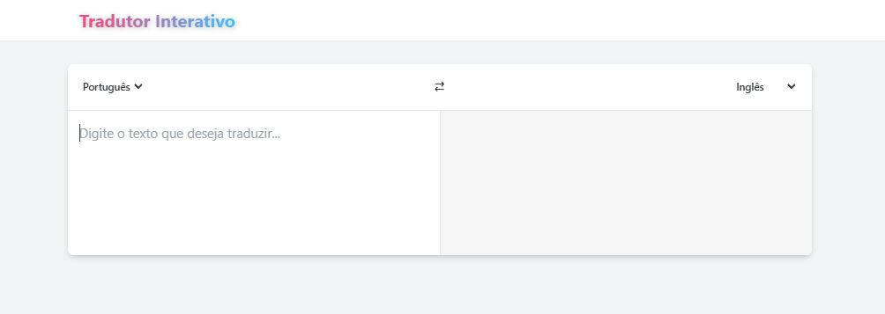
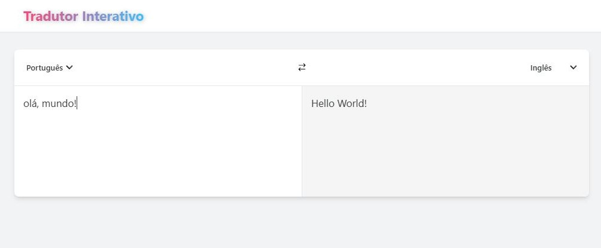

# Tradutor Interativo

Veja o projeto em funcionamento: [Tradutor Interativo na Vercel](https://tradutor-interativo.vercel.app/)

Este projeto foi desenvolvido com o objetivo de permitir que os usuários traduzam textos entre diferentes idiomas de forma interativa. A aplicação oferece suporte a vários idiomas, permitindo que o usuário escolha a língua de entrada e a língua de saída, além de digitar o texto a ser traduzido.

## 🛠 Tecnologias Utilizadas

- **React** (versão 18.3.1)
- **Vite** (versão 5.4.9)
- **Axios** para requisições à API
- **React Icons** para ícones da interface
- **Tailwind CSS** para estilização da aplicação
- **ESLint** para análise estática de código

## 🌟 Funcionalidades Principais

- **Tradução Interativa**: O usuário pode selecionar a língua de entrada e a língua de saída, digitando o texto a ser traduzido.
- **Suporte a Múltiplos Idiomas**: Tradução disponível para inglês, espanhol, francês, alemão, italiano e português.
- **Interface Amigável**: Design responsivo e fácil de usar, permitindo uma experiência de usuário fluida.
- **Atualização em Tempo Real**: A tradução é atualizada em tempo real conforme o usuário digita, semelhante ao funcionamento do Google Tradutor.

## 📸 Imagens e Demonstração

Para melhor ilustrar o funcionamento do projeto, aqui estão algumas imagens prévias da interface principal:




## 🚀 Como Rodar o Projeto

1. Clone o repositório:

   ```bash
   git clone https://github.com/Fabricio-santuchi/Tradutor-Interativo.git
   ```

2. Acesse o diretório do projeto:

   ```bash
   cd Tradutor-Interativo
   ```

3. Instale as dependências:

   ```bash
   npm install
   ```

4. Inicie o servidor de desenvolvimento:

   ```bash
   npm run dev
   ```

5. Acesse o projeto no navegador:

   O projeto será aberto no endereço `http://localhost:5173`.

## 📜 Scripts Disponíveis

- **`npm run dev`**: Inicia o servidor de desenvolvimento.
- **`npm run build`**: Cria uma versão otimizada para produção.
- **`npm run lint`**: Executa o ESLint para verificar erros de código.
- **`npm run preview`**: Visualiza a versão de produção da aplicação.

## 📂 Estrutura de Pastas

Abaixo está a estrutura de diretórios e arquivos deste projeto:

```bash
TRADUTOR-INTERATIVO/
│
├── node_modules/          # Dependências do Node.js
├── public/                # Arquivos públicos
│   ├── preview.png        # Imagem de preview do projeto
│
├── src/                   # Diretório principal de código-fonte
│   ├── components/        # Componentes React do projeto
│   │   ├── ChangeButton/
│   │   ├── ContainerLanguageSelector
│   │   ├── Footer
│   │   ├── HeaderApp
│   │   ├── Loader
│   │   ├── MsgError
│   │   ├── MsgTraduzida
│   │   ├── SelectLang
│   │   └── TextSource
│   ├── contexts/          # Contextos da aplicação
│   │   └── LanguageContext.jsx
│   ├── hooks/             # Hooks personalizados
│   │   └── useLanguage
│   ├── App.jsx            # Componente principal do App
│   ├── index.css          # Arquivo de estilos globais
│   └── main.jsx           # Ponto de entrada da aplicação React
│
├── .gitignore             # Arquivo Gitignore
├── eslint.config.js       # Configurações do ESLint
├── index.html             # Ponto de entrada HTML
├── package.json           # Configurações do projeto e dependências
├── package-lock.json      # Arquivo de bloqueio de dependências do npm
├── README.md              # Documentação do projeto
├── postcss.config.js      # Configurações do PostCSS
├── tailwind.config.js     # Configurações do Tailwind CSS
└── vite.config.js         # Configurações do Vite (build tool)
```

## 📦 Dependências

- **React**: Biblioteca JavaScript para construção de interfaces de usuário.
- **React DOM**: Pacote para renderizar componentes React no DOM.
- **Vite**: Ferramenta de build ultrarrápida para projetos front-end.
- **Axios**: Biblioteca para fazer requisições HTTP.
- **React Icons**: Biblioteca para ícones em projetos React.
- **Tailwind CSS**: Framework CSS para estilização rápida e responsiva.

### 🛠 Dependências de Desenvolvimento

- **@types/react** e **@types/react-dom**: Tipos TypeScript para React.
- **ESLint**: Ferramenta para identificar e corrigir problemas no código.
- **Vite Plugin React**: Suporte para React dentro do Vite.

## 📚 Projeto Inspirado

Este projeto foi desenvolvido com base em um vídeo do **DevClub | Programação**, onde aprendi a criar um tradutor usando a [API MyMemory](https://mymemory.translated.net/) Você pode conferir o vídeo [aqui](https://www.youtube.com/watch?v=PIDu3fePvM8). Agradeço ao DevClub pelo excelente conteúdo que ajudou a aprimorar minhas habilidades em desenvolvimento.

## ✍️ Autor

**Fabrício Santuchi**  
Estudante de **Sistemas de Informação** e desenvolvedor front-end. Apaixonado por criar soluções práticas e funcionais usando as mais recentes tecnologias.
